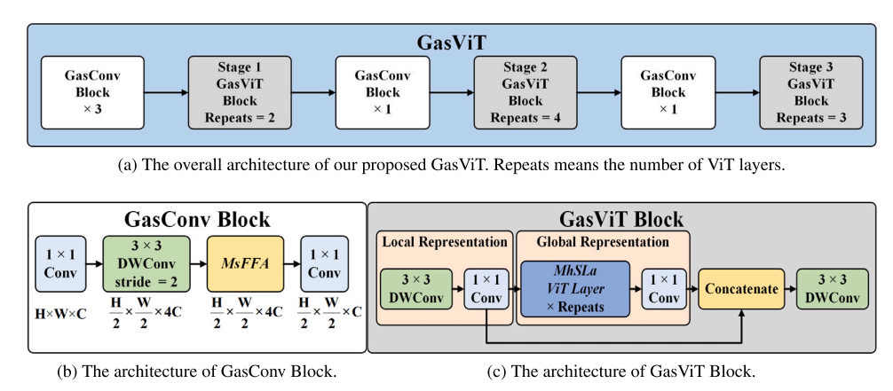
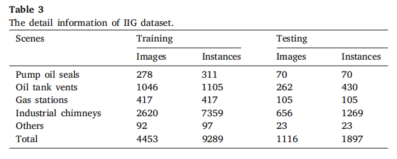

# The-Industrial-Invisible-Gas-IIG-Dataset
This is the home page for the paper “A Lightweight Network Based on Local-Global Feature Fusion For Real-Time Industrial Invisible Gas Detection with Infrared Thermography”.
### [Paper](https://www.sciencedirect.com/science/article/pii/S1568494623011560)
# GasViT Network



# IIG Dataset



The IIG Dataset was collected using the VF330-VOC series of specialised thermal imaging cameras for gas leakage detection from Zhejiang Hongpu Technology Co.,Ltd.
And the dataset will be available after sending an email explaining your purpose to 22225179@zju.edu.cn, thanks!

# Citation
Please give us a STAR if the dataset and code help you!
```
@article{YU2026111931,
title = {GasSeg: A lightweight real-time infrared gas segmentation network for edge devices},
journal = {Pattern Recognition},
volume = {170},
pages = {111931},
year = {2026},
issn = {0031-3203},
doi = {https://doi.org/10.1016/j.patcog.2025.111931},
url = {https://www.sciencedirect.com/science/article/pii/S0031320325005916},
author = {Huan Yu and Jin Wang and Jingru Yang and Kaixiang Huang and Yang Zhou and Fengtao Deng and Guodong Lu and Shengfeng He},
keywords = {Infrared gas segmentation, Boundary guidance network, Contextual attention, Real-time efficiency, Engineering application},
abstract = {Infrared gas segmentation (IGS) focuses on identifying gas regions within infrared images, playing a crucial role in gas leakage prevention, detection, and response. However, deploying IGS on edge devices introduces strict efficiency requirements, and the intricate shapes and weak visual features of gases pose significant challenges for accurate segmentation. To address these challenges, we propose GasSeg, a dual-branch network that leverages boundary and contextual cues to achieve real-time and precise IGS. Firstly, a Boundary-Aware Stem is introduced to enhance boundary sensitivity in shallow layers by leveraging fixed gradient operators, facilitating efficient feature extraction for gases with diverse shapes. Subsequently, a dual-branch architecture comprising a context branch and a boundary guidance branch is employed, where boundary features refine contextual representations to alleviate errors caused by blurred contours. Finally, a Contextual Attention Pyramid Pooling Module captures key information through context-aware multi-scale feature aggregation, ensuring robust gas recognition under subtle visual conditions. To advance IGS research and applications, we introduce a high-quality real-world IGS dataset comprising 6,426 images. Experimental results demonstrate that GasSeg outperforms state-of-the-art models in both accuracy and efficiency, achieving 90.68% mIoU and 95.02% mF1, with real-time inference speeds of 215 FPS on a GPU platform and 62 FPS on an edge platform. The dataset and code are publicly available at: https://github.com/FisherYuuri/GasSeg.}
}
```
